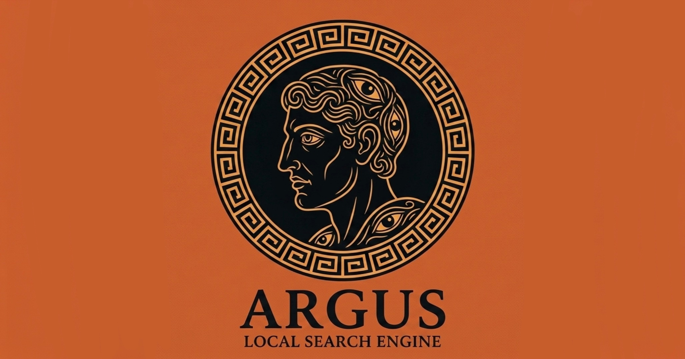

# Argus

A fully offline, air-gapped document search engine with retrieval-augmented
generation (RAG). Combines a C++ inverted index (keyword and phrase search,
TF-IDF ranking) with ChromaDB semantic search, and generates grounded
answers using a local Ollama LLM. No data ever leaves your machine.

Named after *Argus Panoptes*, the *many-eyed giant* from *Greek mythology* who
could watch everything at once. Fitting for a tool built to search across
every document you have, without missing anything and without sending
any of it out to the cloud.

## Setup

1. Install Python 3.11+ and create a virtual environment:
   python -m venv venv
   venv\Scripts\activate

2. Install dependencies:
   pip install -r requirements.txt

3. Compile the C++ indexer (requires g++, e.g. via MSYS2/MinGW):
   g++ src/indexer/indexer.cpp -O2 -o src/indexer/indexer.exe

4. Install Tesseract OCR (https://github.com/UB-Mannheim/tesseract/wiki)
   for scanned PDF support.

5. Install Ollama (https://ollama.com/download) and pull a model:
   ollama pull llama3.2:1b

## Usage

CLI:
python main.py <folder_path>

`example`:
python main.py data/documents

Desktop app:
python src/ui/app.py

- Type a query for hybrid keyword and semantic search, with an AI-generated answer.
- Prefix with `phrase:` for exact phrase search, e.g. `phrase:inverted index`.
- Type `quit` to exit the CLI.

## Supported file types

PDF (including scanned pages via OCR), TXT, DOCX, PPTX.

## Benchmarks

See [BENCHMARKS.md](BENCHMARKS.md) for indexing throughput and query
latency numbers on real test corpora.

## Architecture

- `src/extractor/` : text extraction and Pydantic path/type validation
- `src/indexer/` : C++ positional inverted index (keyword and phrase search)
- `src/search/` : Python orchestration: TF-IDF ranking, ChromaDB semantic
  search, hybrid merging, Ollama answer generation
- `src/ui/` : desktop GUI (customtkinter)
- `main.py` : CLI entry point